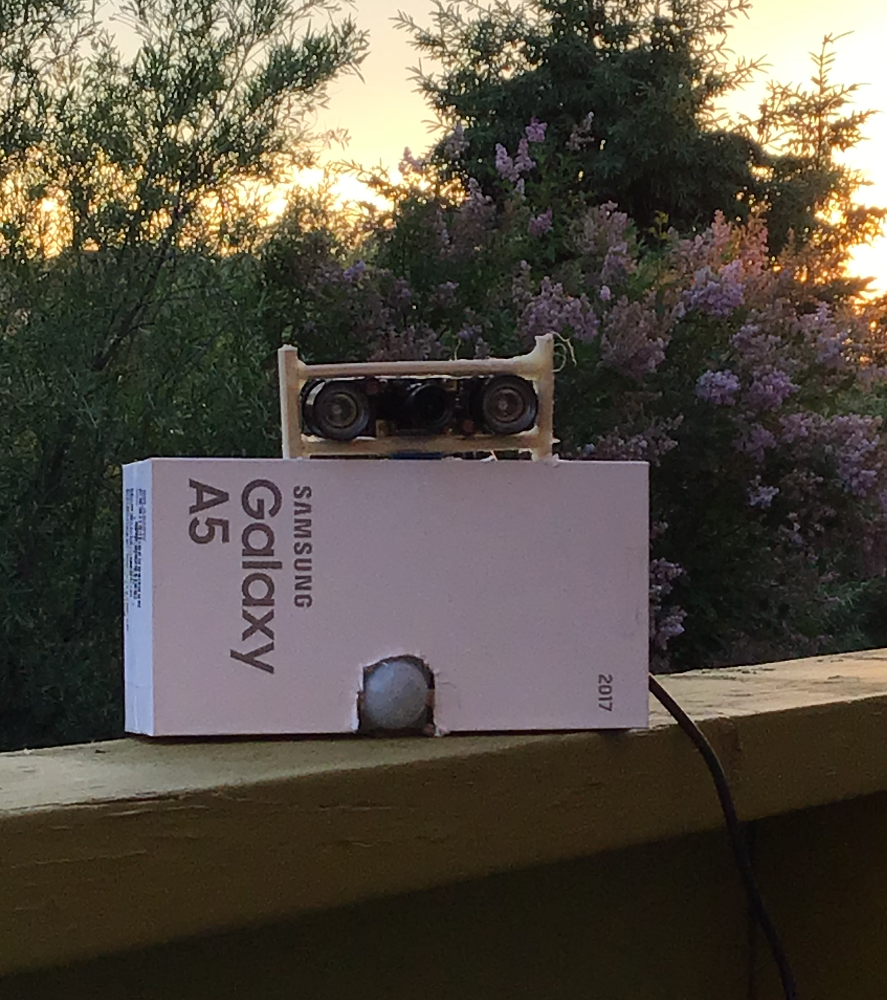
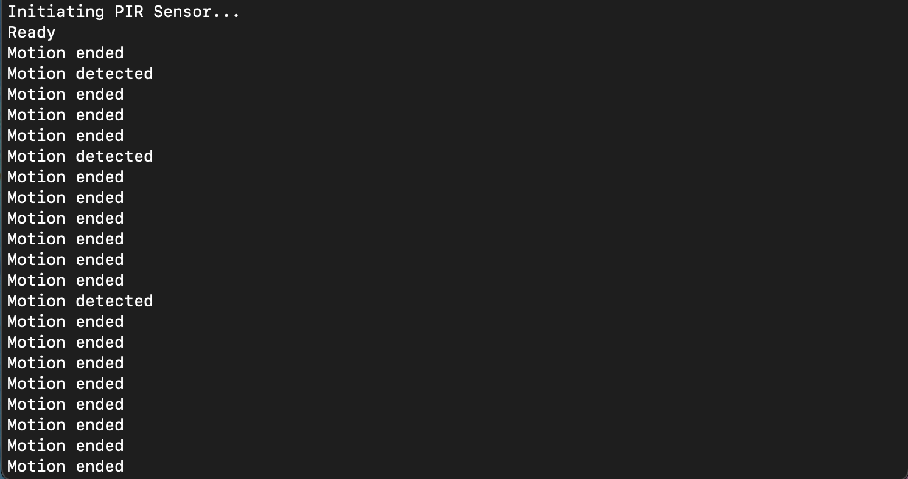
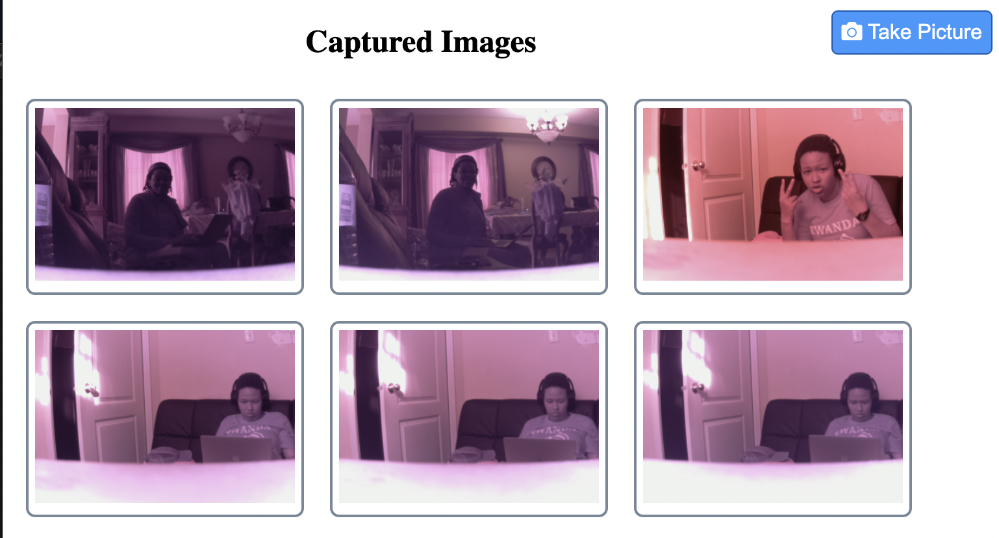
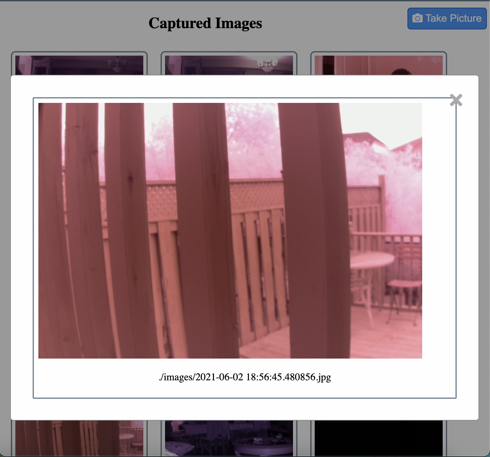

# Pi Security Camera

## Description

Homemade security camera using a PIR sensor and the Raspberry Pi Camera Module to capture images when movement is detected.

### (janky) Hardware

### Terminal Messages

### Website Preview

## Tools

#### Hardware

- Raspberry Pi 2 Model B+
- PIR Sensor
- Breadboard
- 6 jumper wires (without the breadboard, 3 will suffice)

#### Software

- Node (w/ Express.js & PM2)
- Socket.io
- Python 3
- Bash
- HTML/CSS

## Configuration

Use the following image as a guide on the GPIO pins available on the Pi 2 B+

Same for the PIR Sensor ...

- Connect a wire from the 5V pin on the PIR to pin 2 on the Pi
- Connect a wire from the GND pin on the PIR to pin 6 on the Pi
- Connect a wire from the signal pin on the PIR to pin 7 on the Pi; this will be out **input pin**
- Connect the camera using the camera ribbon to the pi. See [here](https://projects.raspberrypi.org/en/projects/getting-started-with-picamera/2) for assembly and camera configuration.
